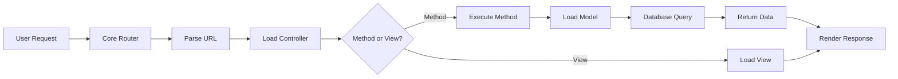

## Overview

SwiftFusePHP follows a classic **Model-View-Controller (MVC)** architecture pattern, providing clear separation of concerns between business logic, data handling, and presentation layers.

## Directory Structure

The framework organizes code into four main directories:

```
swiftfusephp/
├── Controlador/          # Controllers handle application logic
│   ├── Inicio_Controller.php
│   ├── Person_Controller.php
│   └── Error_Controller.php
├── Modelo/               # Models interact with the database
│   ├── Model_Abstract.php
│   ├── Conexion_Model.php
│   ├── Person_Model.php
│   └── Entidad/          # Entity classes
├── Vista/                # Views handle presentation
│   ├── inicio/
│   │   └── index_View.php
│   └── error/
│       └── 404_View.php
└── Libreria/             # Core framework classes
    ├── Core.php
    └── Controlador.php
```

## Architecture Components

### The Core Router

The `Core` class (Libreria/Core.php:6) is the heart of SwiftFusePHP's request handling. It maps URLs to controllers and methods.

<CodeGroup>
```php Core.php
class Core
{
    protected $controladorActual = "Inicio";
    protected $metodoActual = "cargaVista";
    protected $vista = "index";
    protected $parametros = [];

    public function __construct()
    {
        $url = $this->getUrl();
        // Map URL to controller, method, and parameters
    }
}
```
</CodeGroup>

### Controllers

Controllers extend the base `Controlador` class and handle application logic. They:

- Process user requests
- Load models for data operations
- Render views for presentation
- Return JSON responses for AJAX calls

<Note>
All controller files must follow the naming convention: `{Name}_Controller.php` and the class must be named `{Name}Control`
</Note>

### Models

Models extend the abstract `Model` class and manage data operations. They:

- Interact with the database through PDO
- Encapsulate business logic
- Return data to controllers
- Handle error messages

### Views

Views are template files that render HTML. They:

- Display data passed from controllers
- Support both `.php` and `.html` extensions
- Are organized in subdirectories by module

## Request Flow

Here's how a typical request flows through SwiftFusePHP:



<Tabs>
  <Tab title="Step 1: URL Parsing">
    The `Core` class parses the URL into components:
    
    ```
    https://example.com/person/list/5
    ```
    
    Becomes:
    - `$url[0]` = "person" → Controller
    - `$url[1]` = "list" → Method
    - `$url[2]` = "5" → Parameter
  </Tab>
  
  <Tab title="Step 2: Controller Loading">
    The Core loads the controller file:
    
    ```php
    // Loads: Controlador/Person_Controller.php
    // Instantiates: PersonControl class
    ```
  </Tab>
  
  <Tab title="Step 3: Method Execution">
    The controller method is called:
    
    ```php
    // Calls: PersonControl->list($vista, $parametros)
    ```
    
    If the method doesn't exist, it's treated as a view name.
  </Tab>
  
  <Tab title="Step 4: Response">
    The controller either:
    - Renders a view with data
    - Returns JSON for AJAX requests
  </Tab>
</Tabs>

## Example Request

Let's trace a complete request:

**URL:** `http://localhost/person/list`

1. **Core Router** (Libreria/Core.php:15) parses URL
2. **Finds** `Controlador/Person_Controller.php`
3. **Instantiates** `PersonControl` class
4. **Calls** `list()` method
5. **Method loads** `Person_Model` via `$this->modelo("Person")`
6. **Model queries** database with `$this->Conexion->query()`
7. **Returns** JSON response via `$this->retornar()`

<CodeGroup>
```php Controller
class PersonControl extends Controlador
{
    public function list(){
        $data = $this->Person->getAll();
        $this->retorno["data"] = $data;
        $this->retornar(); // Returns JSON
    }
}
```

```php Model
class PersonMode extends Model
{
    public function getAll(){
        $this->Conexion->query("SELECT * FROM people");
        return $this->Conexion->getsArray();
    }
}
```
</CodeGroup>

## Naming Conventions

<Note>
SwiftFusePHP uses specific naming conventions that must be followed:
</Note>

| Component | File Name | Class Name | Example |
|-----------|-----------|------------|---------|
| Controller | `{Name}_Controller.php` | `{Name}Control` | `Person_Controller.php` → `PersonControl` |
| Model | `{Name}_Model.php` | `{Name}Mode` | `Person_Model.php` → `PersonMode` |
| View | `{name}_View.{ext}` | N/A | `index_View.php` |

<Tip>
Notice that controller and model class names use abbreviated suffixes ("Control" and "Mode") rather than the full "Controller" and "Model".
</Tip>

## Configuration

The framework expects certain constants to be defined (typically in a config file):

- `RUTA_APP` - Application root path
- `RUTA_URL` - Base URL
- `HOST` - Database host
- `USERNAME` - Database username  
- `PASSWORD` - Database password
- `DATABASE` - Database name
- `SSL_CA` - SSL certificate path (optional)

## Next Steps

<CardGroup cols={2}>
  <Card title="Routing" icon="route" href="/routing">
    Learn how URL routing works in detail
  </Card>
  <Card title="Controllers" icon="gamepad" href="/controllers">
    Build your first controller
  </Card>
  <Card title="Models" icon="database" href="/models">
    Work with models and databases
  </Card>
  <Card title="Views" icon="eye" href="/views">
    Create view templates
  </Card>
</CardGroup>